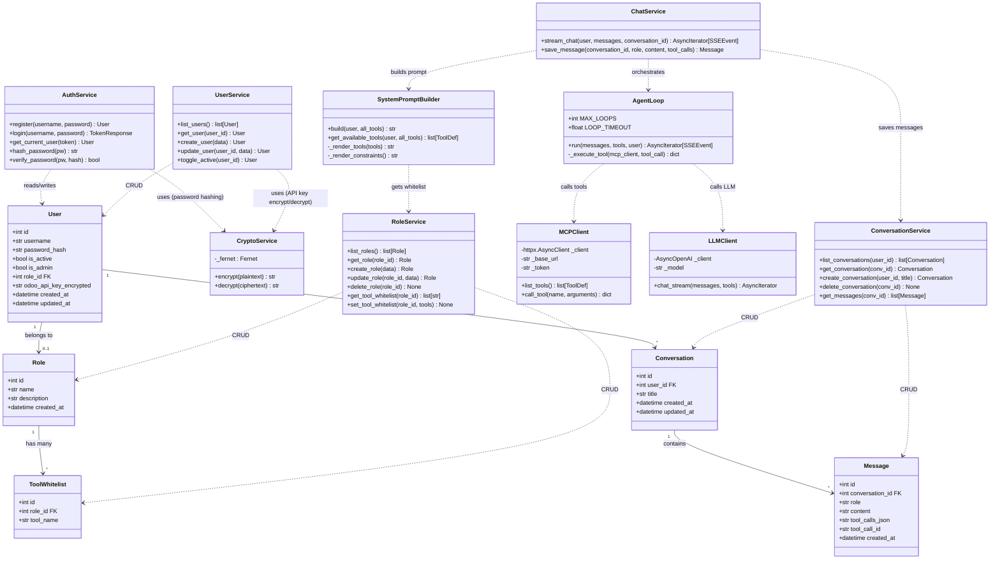
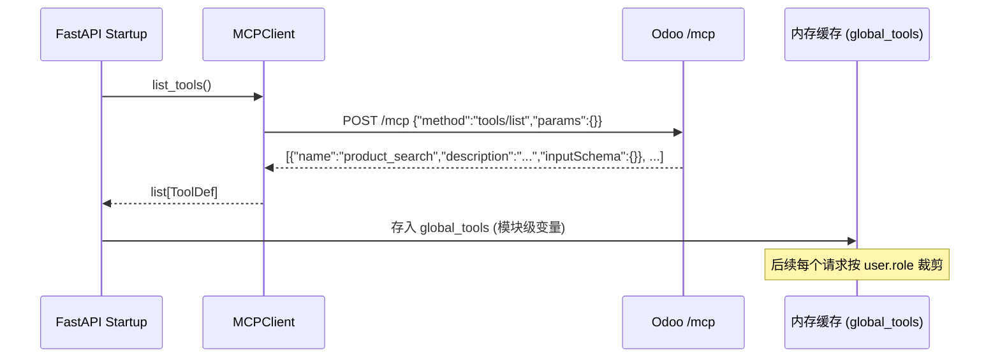
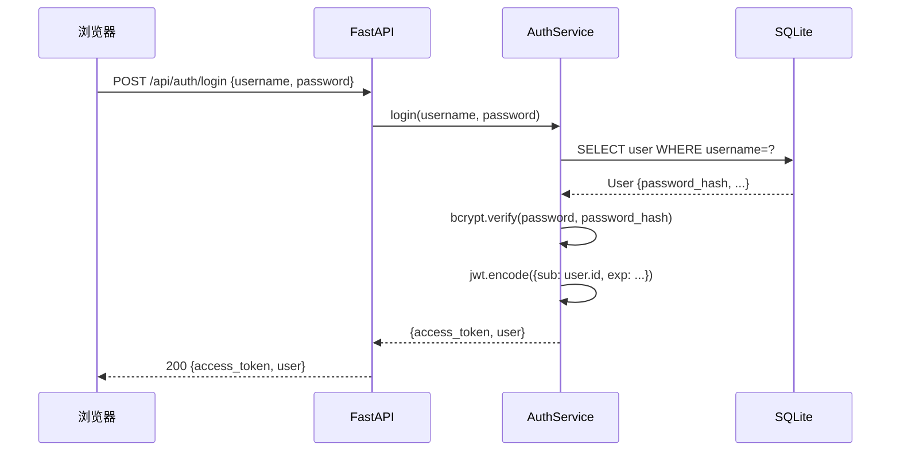
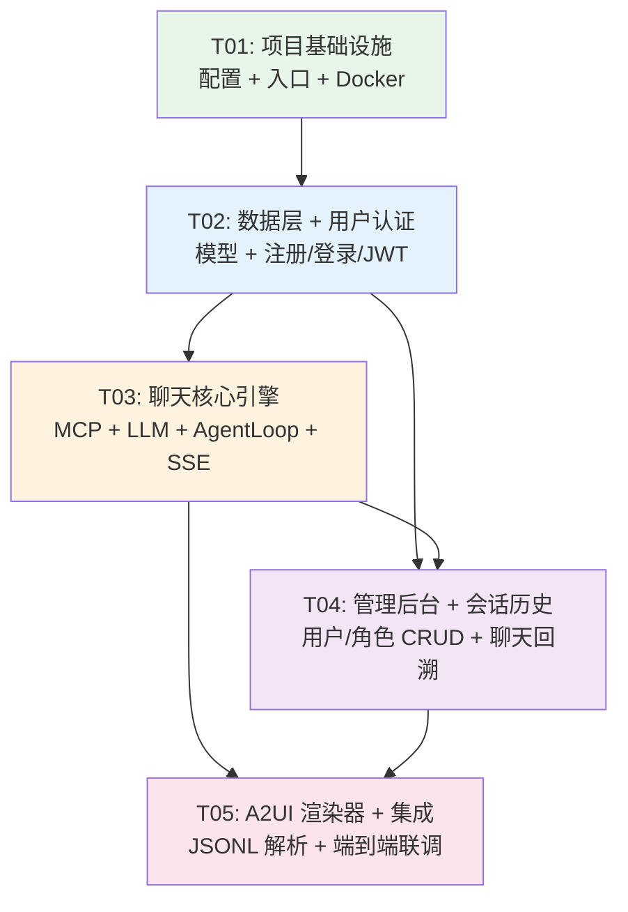

# A2UI 独立 Web 应用 — 系统架构设计

---

## Part A: 系统设计

### 1. 实现方案（Implementation Approach）

#### 1.1 核心技术难点

| 难点 | 分析 | 对策 |
|------|------|------|
| **Agentic Loop 自实现** | 需要循环 tool_calls → 执行 → 回填 → 继续推理，控制循环上限与超时 | 约 80 行异步生成器，`MAX_LOOPS=20`，每轮 30s 超时，使用 `asyncio.wait_for` |
| **动态 System Prompt** | 启动时拉取 Tool 列表，运行时按用户 groups 裁剪注入 | 启动事件 `@app.on_event("startup")` 调用 `tools/list`，缓存全局 Tool 定义；请求时按 user.role.tool_whitelist 过滤 |
| **SSE 流式输出** | LLM 增量 token + tool_call 事件混合推送 | FastAPI `StreamingResponse` + 自定义 SSE 事件类型（`text`/`tool_call`/`tool_result`/`done`/`error`） |
| **MCP JSONRPC 2.0** | HTTP POST + Bearer Token，需处理 `tools/list` 与 `tools/call` 两种模式 | 用 `httpx.AsyncClient` 封装，统一 JSONRPC 请求体：`{"jsonrpc":"2.0","method":"...","params":{...},"id":1}` |
| **A2UI JSONL 渲染** | LLM 输出的 JSONL 文本需在前端逐行解析为交互组件 | TypeScript parser：按 `\n` 分行 → `JSON.parse` → 按 `type` 字段路由到对应 Vue 组件 |
| **四道防线权限** | System Prompt → Tool 白名单 → groups 过滤 → Odoo ACL | 每层独立可测，白名单在 System Prompt 构建阶段裁剪，groups 在 `tools/call` 参数中注入 |

#### 1.2 框架与库选型

| 层 | 选型 | 理由 |
|----|------|------|
| **前端框架** | Vue 3 + Composition API | 已确定，生态成熟，TypeScript 支持好 |
| **构建工具** | Vite 5 | 已确定，HMR 快，Vue 3 官方推荐 |
| **UI 组件库** | Naive UI | 已确定（Q1 结论），Tree-shaking 友好，TypeScript 原生 |
| **CSS 工具** | Tailwind CSS 3 | 补充 Naive UI 未覆盖的布局/间距需求 |
| **状态管理** | Pinia | Vue 3 官方推荐，组合式 API 风格 |
| **路由** | Vue Router 4 | 标准选择 |
| **HTTP 客户端** | Axios | 拦截器 + JWT 注入方便 |
| **图表** | ECharts 5 | A2UI Chart 组件底层渲染引擎 |
| **后端框架** | FastAPI | 已确定，异步原生，SSE/StreamingResponse 开箱即用 |
| **ORM** | SQLAlchemy 2.0 (async) | 异步 SQLite 驱动（aiosqlite），声明式模型 |
| **数据库驱动** | aiosqlite | SQLite 异步访问 |
| **密码哈希** | bcrypt (passlib) | 安全标准 |
| **加密** | cryptography (Fernet) | AES-256 对称加密 Odoo API Key |
| **JWT** | python-jose | JWT 签发与验证 |
| **MCP 通信** | httpx (AsyncClient) | 异步 HTTP，JSONRPC 2.0 POST |
| **LLM 通信** | openai SDK | 兼容 DeepSeek / OpenAI，支持 tool_calls + streaming |
| **SSE 格式化** | sse-starlette | 标准 SSE 事件序列化（可选，FastAPI 原生也可） |

#### 1.3 架构模式

```
┌──────────────────────────────────────────────────────────┐
│                      Nginx (:80)                         │
│             静态文件 / 反向代理 / HTTPS                    │
├──────────────────────┬───────────────────────────────────┤
│    Frontend (Vue 3)  │      Backend (FastAPI :8000)      │
│                      │                                   │
│  Views ← Composables │  API Layer (routers)              │
│    ↓          ↓      │    ↓                              │
│  Stores ← API Client │  Service Layer (business logic)    │
│    ↓                 │    ↓                              │
│  Components          │  Model Layer (SQLAlchemy)          │
│                      │    ↓                              │
│  Naive UI + Tailwind │  SQLite (aiosqlite)               │
│                      │                                   │
│                      │  External:                         │
│                      │  ├─ LLM API (DeepSeek/OpenAI)      │
│                      │  └─ Odoo /mcp (JSONRPC 2.0)       │
└──────────────────────┴───────────────────────────────────┘
```

- **后端**：经典分层架构（Router → Service → Model/Client），Service 层不感知 HTTP
- **前端**：View → Store/Composable → API Client 单向数据流，Pinia 管理全局状态

---

### 2. 文件列表（File List）

```
a2ui_web/
├── docker-compose.yml
├── .env.example
├── .gitignore
├── README.md
│
├── backend/
│   ├── Dockerfile
│   ├── requirements.txt
│   ├── alembic.ini
│   ├── app/
│   │   ├── __init__.py
│   │   ├── main.py                      # FastAPI 应用入口 + startup/shutdown 事件
│   │   ├── config.py                    # pydantic-settings 配置管理
│   │   ├── database.py                  # SQLAlchemy engine + session + Base
│   │   │
│   │   ├── models/
│   │   │   ├── __init__.py
│   │   │   ├── user.py                  # User 模型
│   │   │   ├── role.py                  # Role 模型
│   │   │   ├── conversation.py          # Conversation + Message 模型
│   │   │   └── tool_whitelist.py        # ToolWhitelist 模型
│   │   │
│   │   ├── schemas/
│   │   │   ├── __init__.py
│   │   │   ├── auth.py                  # LoginRequest/RegisterRequest/TokenResponse
│   │   │   ├── user.py                  # UserCreate/Update/Response
│   │   │   ├── role.py                  # RoleCreate/Update/Response
│   │   │   ├── chat.py                  # ChatRequest/ChatMessage/SSEEvent
│   │   │   └── conversation.py          # ConversationResponse/MessageResponse
│   │   │
│   │   ├── api/
│   │   │   ├── __init__.py
│   │   │   ├── auth.py                  # POST /api/auth/login, /api/auth/register
│   │   │   ├── chat.py                  # POST /api/chat (SSE streaming)
│   │   │   ├── users.py                 # CRUD /api/admin/users/*
│   │   │   ├── roles.py                 # CRUD /api/admin/roles/*
│   │   │   ├── conversations.py         # GET/DELETE /api/conversations/*
│   │   │   └── tools.py                 # GET /api/tools (当前可用 Tool 列表)
│   │   │
│   │   ├── services/
│   │   │   ├── __init__.py
│   │   │   ├── auth_service.py          # 注册/登录/密码哈希/JWT 签发
│   │   │   ├── chat_service.py          # 聊天编排：组装 messages → AgentLoop
│   │   │   ├── agent_loop.py            # Agentic Loop 核心（~80行）
│   │   │   ├── llm_client.py            # openai SDK 封装（DeepSeek/OpenAI）
│   │   │   ├── mcp_client.py            # MCP JSONRPC 2.0 客户端
│   │   │   ├── system_prompt.py         # System Prompt 动态构建
│   │   │   ├── user_service.py          # 用户 CRUD + 角色绑定
│   │   │   ├── role_service.py          # 角色 CRUD + Tool 白名单
│   │   │   ├── conversation_service.py  # 会话/消息 CRUD
│   │   │   └── crypto_service.py        # AES-256 加解密 (Fernet)
│   │   │
│   │   └── middleware/
│   │       ├── __init__.py
│   │       └── auth_middleware.py        # JWT 验证依赖 (Depends)
│   │
│   └── tests/
│       ├── __init__.py
│       ├── test_auth.py
│       ├── test_agent_loop.py
│       ├── test_mcp_client.py
│       └── test_security.py
│
├── frontend/
│   ├── Dockerfile
│   ├── package.json
│   ├── vite.config.ts
│   ├── tsconfig.json
│   ├── tsconfig.node.json
│   ├── tailwind.config.ts
│   ├── postcss.config.js
│   ├── index.html
│   ├── env.d.ts
│   │
│   └── src/
│       ├── main.ts                      # Vue 应用入口
│       ├── App.vue                      # 根组件
│       │
│       ├── router/
│       │   └── index.ts                 # 路由配置（含守卫）
│       │
│       ├── stores/
│       │   ├── auth.ts                  # 认证状态 (Pinia)
│       │   ├── chat.ts                  # 聊天状态
│       │   └── conversation.ts          # 会话列表状态
│       │
│       ├── composables/
│       │   ├── useSSE.ts               # SSE 流读取 + 解析
│       │   └── useAuth.ts              # 登录状态 + 路由守卫逻辑
│       │
│       ├── views/
│       │   ├── LoginView.vue            # 登录页
│       │   ├── RegisterView.vue         # 注册页
│       │   ├── ChatView.vue             # 主聊天页
│       │   ├── AdminLayout.vue          # 管理后台布局
│       │   └── admin/
│       │       ├── UserManagement.vue   # 用户管理页
│       │       └── RoleManagement.vue   # 角色管理页
│       │
│       ├── components/
│       │   ├── layout/
│       │   │   ├── TopNavbar.vue        # 顶部导航栏
│       │   │   └── Sidebar.vue          # 会话列表侧边栏
│       │   ├── chat/
│       │   │   ├── ChatMessage.vue      # 消息气泡（用户/AI/Tool）
│       │   │   ├── ChatInput.vue        # 输入框 + 发送按钮
│       │   │   ├── StreamingText.vue    # SSE 流式文本渲染
│       │   │   └── ToolCallBubble.vue   # Tool 调用状态气泡
│       │   ├── a2ui/
│       │   │   ├── A2UIRenderer.vue     # JSONL 解析器 + 组件路由
│       │   │   ├── A2UICard.vue         # 卡片组件
│       │   │   ├── A2UITable.vue        # 表格组件
│       │   │   └── A2UIChart.vue        # 图表组件（ECharts）
│       │   └── admin/
│       │       ├── UserTable.vue        # 用户列表表格
│       │       ├── UserFormModal.vue    # 用户创建/编辑弹窗
│       │       ├── RoleTable.vue        # 角色列表表格
│       │       ├── RoleFormModal.vue    # 角色创建/编辑弹窗
│       │       └── ToolCheckboxGroup.vue# Tool 白名单勾选组
│       │
│       ├── api/
│       │   ├── client.ts               # Axios 实例 + JWT 拦截器
│       │   ├── auth.ts                 # 登录/注册 API
│       │   ├── chat.ts                 # 聊天 SSE API
│       │   ├── admin.ts                # 用户/角色管理 API
│       │   └── conversation.ts         # 会话历史 API
│       │
│       ├── types/
│       │   ├── index.ts                # 通用类型
│       │   ├── chat.ts                 # 聊天消息类型
│       │   ├── a2ui.ts                 # A2UI JSONL 类型定义
│       │   └── admin.ts                # 管理后台类型
│       │
│       └── utils/
│           ├── sse-parser.ts           # SSE 事件流解析器
│           └── a2ui-parser.ts          # A2UI JSONL 行解析器
│
└── nginx/
    ├── Dockerfile
    ├── nginx.conf
    └── default.conf
```

---

### 3. 数据结构与接口（类图）



---

### 4. 程序调用流程（时序图）

#### 4.1 聊天请求完整流程（SSE 流式）

```mermaid
sequenceDiagram
    participant Browser as 浏览器
    participant Nginx as Nginx
    participant FastAPI as FastAPI (/api/chat)
    participant Auth as JWT Middleware
    participant ChatSvc as ChatService
    participant Prompt as SystemPromptBuilder
    participant Loop as AgentLoop
    participant LLM as LLMClient (DeepSeek/OpenAI)
    participant MCP as MCPClient (Odoo /mcp)
    participant DB as SQLite

    Browser->>Nginx: POST /api/chat {messages, conversation_id?}
    Nginx->>FastAPI: proxy pass
    FastAPI->>Auth: verify JWT → User
    Auth-->>FastAPI: User {id, role, odoo_token}

    FastAPI->>ChatSvc: stream_chat(user, messages, conv_id)

    rect rgb(240, 248, 255)
        Note over ChatSvc,DB: 1. 准备阶段
        ChatSvc->>Prompt: build(user, global_tools)
        Prompt-->>ChatSvc: system_prompt + filtered_tools
        ChatSvc->>DB: get_or_create conversation
        DB-->>ChatSvc: conversation
        ChatSvc->>DB: save user message
    end

    rect rgb(255, 248, 240)
        Note over ChatSvc,MCP: 2. Agentic Loop (MAX_LOOPS=20)
        ChatSvc->>Loop: run(messages + system_prompt, tools, user)

        loop 每轮推理 (最多 20 次)
            Loop->>LLM: chat_stream(messages, tools)
            LLM-->>Loop: SSE delta (content chunk)

            alt 有文本内容
                Loop-->>Browser: SSE: event=text, data={delta}
            else 有 tool_calls
                Loop-->>Browser: SSE: event=tool_call, data={name, args}
                Loop->>MCP: call_tool(name, args, odoo_token)
                MCP-->>Loop: tool_result
                Loop-->>Browser: SSE: event=tool_result, data={name, result}
                Loop->>Loop: 回填 tool result 到 messages
            else 推理完成 (finish_reason=stop)
                Loop-->>ChatSvc: done
            end
        end
    end

    rect rgb(240, 255, 240)
        Note over ChatSvc,Browser: 3. 收尾
        ChatSvc->>DB: save assistant message
        ChatSvc-->>Browser: SSE: event=done, data={conversation_id}
    end
```

#### 4.2 启动时 Tool 列表拉取



#### 4.3 用户认证流程



---

### 5. 待明确事项（Anything UNCLEAR）

| # | 事项 | 假设/处理方式 |
|---|------|--------------|
| 1 | A2UI JSONL 的具体字段规范（`type` 有哪些值？Schema？） | 假设 `type` 至少包含 `card`/`table`/`chart`，每个 type 有 `data` 和 `props` 字段。若实际规范不同，仅需修改 `a2ui-parser.ts` 和 `A2UIRenderer.vue` |
| 2 | Odoo `/mcp` 端点的 `tools/call` 返回格式（是否异步？是否有中间状态？） | 假设同步返回 JSON 结果。若 Odoo 端支持异步 task，需扩展 MCPClient 增加轮询逻辑 |
| 3 | admin 用户的初始化方式 | 假设提供启动脚本或 API 种子数据（`python -m app.seed`），创建默认 admin 账号 |
| 4 | 是否需要 WebSocket 替代 SSE？ | 当前设计为 SSE（单向流），足够满足需求。若未来需要双向实时通信（如中断生成），可升级为 WebSocket |
| 5 | 前端路由模式（History vs Hash） | 使用 History 模式，Nginx 配置 `try_files` 回退到 `index.html` |

---

## Part B: 任务分解

### 6. 所需依赖包（Required Packages）

#### 后端 (requirements.txt)

```
fastapi==0.115.*
uvicorn[standard]==0.32.*
sqlalchemy[asyncio]==2.0.*
aiosqlite==0.20.*
pydantic==2.10.*
pydantic-settings==2.7.*
python-jose[cryptography]==3.3.*
passlib[bcrypt]==1.7.*
bcrypt==4.0.*
cryptography==44.*
httpx==0.28.*
openai==1.58.*
sse-starlette==2.2.*
python-multipart==0.0.*
alembic==1.14.*
```

#### 前端 (package.json)

```
- vue@^3.5: 核心框架
- vue-router@^4.4: 路由
- pinia@^2.2: 状态管理
- naive-ui@^2.40: UI 组件库
- @vicons/ionicons5: Naive UI 图标
- tailwindcss@^3.4: 原子化 CSS
- postcss@^8.4: CSS 处理
- autoprefixer@^10.4: CSS 前缀
- axios@^1.7: HTTP 客户端
- echarts@^5.5: 图表库
- vue-echarts@^7.0: ECharts Vue 集成
- @types/node@^22: Node 类型
- typescript@^5.6: TypeScript
- vite@^6.0: 构建工具
- @vitejs/plugin-vue@^5.2: Vue 插件
```

---

### 7. 任务列表（Task List）

#### T01 — 项目基础设施

| 字段 | 内容 |
|------|------|
| **Task ID** | T01 |
| **Task Name** | 项目基础设施（配置 + 入口 + 容器化） |
| **优先级** | P0 |
| **依赖** | 无 |

**源文件**：

| 类别 | 文件 |
|------|------|
| 根配置 | `docker-compose.yml`, `.env.example`, `.gitignore` |
| 后端配置 | `backend/requirements.txt`, `backend/Dockerfile`, `backend/app/__init__.py`, `backend/app/main.py`, `backend/app/config.py`, `backend/app/database.py` |
| 前端配置 | `frontend/package.json`, `frontend/vite.config.ts`, `frontend/tsconfig.json`, `frontend/tsconfig.node.json`, `frontend/tailwind.config.ts`, `frontend/postcss.config.js`, `frontend/index.html`, `frontend/env.d.ts`, `frontend/Dockerfile`, `frontend/src/main.ts`, `frontend/src/App.vue`, `frontend/src/router/index.ts` |
| Nginx | `nginx/Dockerfile`, `nginx/nginx.conf`, `nginx/default.conf` |

**内容说明**：
- **docker-compose.yml**：定义 3 个服务 — `nginx`（端口 80）、`backend`（端口 8000，不对外暴露）、`frontend`（构建阶段，产物挂载到 nginx）
- **config.py**：使用 `pydantic-settings`，从 `.env` 读取所有配置（SECRET_KEY, LLM_API_KEY, LLM_BASE_URL, LLM_MODEL, ODOO_MCP_URL, DATABASE_URL 等）
- **database.py**：`create_async_engine` + `async_sessionmaker` + `Base`，`get_db` 依赖
- **main.py**：FastAPI app 创建，CORS 中间件，`@app.on_event("startup")` 调用 MCP `tools/list` 加载全局 Tool 定义，挂载所有 router
- **router/index.ts**：路由表 — `/login`, `/register`, `/chat`, `/admin/users`, `/admin/roles`，含 `beforeEach` 守卫检查 JWT
- **Nginx**：反向代理 `/api/*` → `backend:8000`，静态文件服务 `frontend/dist`，History 模式 `try_files`

---

#### T02 — 数据层 + 用户认证

| 字段 | 内容 |
|------|------|
| **Task ID** | T02 |
| **Task Name** | 数据模型 + 用户认证系统（注册/登录/JWT） |
| **优先级** | P0 |
| **依赖** | T01（项目基础设施） |

**源文件**：

| 类别 | 文件 |
|------|------|
| 后端模型 | `backend/app/models/__init__.py`, `backend/app/models/user.py`, `backend/app/models/role.py`, `backend/app/models/tool_whitelist.py` |
| 后端 Schema | `backend/app/schemas/__init__.py`, `backend/app/schemas/auth.py`, `backend/app/schemas/user.py`, `backend/app/schemas/role.py` |
| 后端服务 | `backend/app/services/__init__.py`, `backend/app/services/crypto_service.py`, `backend/app/services/auth_service.py` |
| 后端中间件 | `backend/app/middleware/__init__.py`, `backend/app/middleware/auth_middleware.py` |
| 后端 API | `backend/app/api/__init__.py`, `backend/app/api/auth.py` |
| 后端测试 | `backend/tests/test_auth.py` |
| 前端类型 | `frontend/src/types/index.ts`, `frontend/src/types/admin.ts` |
| 前端 API | `frontend/src/api/client.ts`, `frontend/src/api/auth.ts` |
| 前端 Store | `frontend/src/stores/auth.ts` |
| 前端 Composable | `frontend/src/composables/useAuth.ts` |
| 前端视图 | `frontend/src/views/LoginView.vue`, `frontend/src/views/RegisterView.vue` |
| 前端组件 | `frontend/src/components/layout/TopNavbar.vue` |

**内容说明**：
- **User 模型**：字段含 `password_hash`（bcrypt）、`odoo_api_key_encrypted`（AES-256 Fernet）、`role_id` 外键
- **Role 模型**：基础 `name` + `description`
- **ToolWhitelist 模型**：`role_id` + `tool_name` 复合唯一约束
- **crypto_service.py**：封装 `cryptography.fernet.Fernet`，密钥来自 `config.SECRET_KEY` 派生
- **auth_service.py**：`register()` 校验用户名唯一性 → bcrypt 哈希 → 存入 DB；`login()` 验证密码 → 签发 JWT（过期 24h）
- **auth_middleware.py**：`Depends(get_current_user)`，从 `Authorization: Bearer <token>` 解析 JWT，返回 User
- **前端 auth store**：存储 token 到 localStorage，提供 `isLoggedIn`、`isAdmin` getter
- **client.ts**：Axios 实例，请求拦截器注入 Bearer Token，响应拦截器处理 401 跳转登录页
- **LoginView / RegisterView**：Naive UI `n-form` + `n-input` + `n-button`，表单校验 + 错误提示

---

#### T03 — 聊天核心（Agentic Loop + SSE + MCP + LLM）

| 字段 | 内容 |
|------|------|
| **Task ID** | T03 |
| **Task Name** | 聊天核心引擎（MCP 客户端 + LLM 客户端 + System Prompt + Agentic Loop + SSE 流式） |
| **优先级** | P0 |
| **依赖** | T02（认证就绪，需要 User 模型和 JWT 中间件） |

**源文件**：

| 类别 | 文件 |
|------|------|
| 后端服务 | `backend/app/services/mcp_client.py`, `backend/app/services/llm_client.py`, `backend/app/services/system_prompt.py`, `backend/app/services/agent_loop.py`, `backend/app/services/chat_service.py` |
| 后端 Schema | `backend/app/schemas/chat.py` |
| 后端 API | `backend/app/api/chat.py`, `backend/app/api/tools.py` |
| 后端测试 | `backend/tests/test_mcp_client.py`, `backend/tests/test_agent_loop.py` |
| 前端类型 | `frontend/src/types/chat.ts` |
| 前端 API | `frontend/src/api/chat.ts` |
| 前端 Store | `frontend/src/stores/chat.ts` |
| 前端 Composable | `frontend/src/composables/useSSE.ts` |
| 前端视图 | `frontend/src/views/ChatView.vue` |
| 前端组件 | `frontend/src/components/chat/ChatMessage.vue`, `frontend/src/components/chat/ChatInput.vue`, `frontend/src/components/chat/StreamingText.vue`, `frontend/src/components/chat/ToolCallBubble.vue` |
| 前端工具 | `frontend/src/utils/sse-parser.ts` |

**内容说明**：
- **mcp_client.py**：封装 `httpx.AsyncClient`，`list_tools()` → POST `{"jsonrpc":"2.0","method":"tools/list","id":1}`，`call_tool(name, args)` → POST `{"jsonrpc":"2.0","method":"tools/call","params":{"name":...,"arguments":...},"id":2}`，均带 `Authorization: Bearer <odoo_token>` 头
- **llm_client.py**：`AsyncOpenAI` 客户端，`chat_stream(messages, tools)` → `client.chat.completions.create(model=..., messages=..., tools=..., stream=True)`，yield 每个 chunk
- **system_prompt.py**：`build(user, all_tools)` → 从 `all_tools` 中按 `user.role.tool_whitelist` 过滤 → 拼接 System Prompt（角色定义 + 约束 + Tool JSON Schema 列表）
- **agent_loop.py** (~80行)：异步生成器 `run(messages, tools, user_mcp_token)`：
  1. loop (max 20): 调用 `llm_client.chat_stream()`
  2. 收集完整响应 → 如有 `content` → yield SSE text 事件
  3. 如有 `tool_calls` → yield SSE tool_call 事件 → 调 `mcp_client.call_tool()` → yield SSE tool_result 事件 → 回填 messages
  4. 如 `finish_reason=stop` → yield SSE done 事件 → break
  5. 每轮 `asyncio.wait_for(30s)` 超时保护
- **chat_service.py**：编排层，`stream_chat(user, messages, conv_id)` → 构建 System Prompt → 创建/获取会话 → 保存用户消息 → 调 `agent_loop.run()` → 保存助手消息 → yield 所有事件
- **chat.py (API)**：`POST /api/chat` → `StreamingResponse(chat_service.stream_chat(), media_type="text/event-stream")`
- **tools.py (API)**：`GET /api/tools` → 返回当前用户可用的 Tool 列表（用于前端展示）
- **sse-parser.ts**：解析 SSE 文本流，按 `event:` 和 `data:` 行分割，emit `text`/`tool_call`/`tool_result`/`done`/`error` 事件
- **useSSE.ts**：Vue composable，调用 `fetch()` 读取 `ReadableStream`，逐块 feed 给 sse-parser，返回 reactive 状态
- **ChatView.vue**：组合 Sidebar + 消息列表 + ChatInput，管理消息状态，调用 SSE composable
- **StreamingText.vue**：接收 `text` prop，逐字渲染动画
- **ToolCallBubble.vue**：显示 Tool 调用名称、参数、执行状态（loading/success/error）

---

#### T04 — 管理后台 + 会话历史

| 字段 | 内容 |
|------|------|
| **Task ID** | T04 |
| **Task Name** | 管理后台（用户/角色/Tool白名单）+ 聊天历史存储与回溯 |
| **优先级** | P1 |
| **依赖** | T02（模型 + 认证），T03（聊天核心就绪后可保存消息） |

**源文件**：

| 类别 | 文件 |
|------|------|
| 后端模型 | `backend/app/models/conversation.py` |
| 后端 Schema | `backend/app/schemas/conversation.py` |
| 后端服务 | `backend/app/services/user_service.py`, `backend/app/services/role_service.py`, `backend/app/services/conversation_service.py` |
| 后端 API | `backend/app/api/users.py`, `backend/app/api/roles.py`, `backend/app/api/conversations.py` |
| 前端 API | `frontend/src/api/admin.ts`, `frontend/src/api/conversation.ts` |
| 前端 Store | `frontend/src/stores/conversation.ts` |
| 前端视图 | `frontend/src/views/AdminLayout.vue`, `frontend/src/views/admin/UserManagement.vue`, `frontend/src/views/admin/RoleManagement.vue` |
| 前端组件 | `frontend/src/components/admin/UserTable.vue`, `frontend/src/components/admin/UserFormModal.vue`, `frontend/src/components/admin/RoleTable.vue`, `frontend/src/components/admin/RoleFormModal.vue`, `frontend/src/components/admin/ToolCheckboxGroup.vue`, `frontend/src/components/layout/Sidebar.vue` |

**内容说明**：
- **Conversation 模型**：`user_id` FK → User，`title`（自动取首条消息前 50 字），级联删除 Messages
- **Message 模型**：`role`（user/assistant/tool），`content`（TEXT），`tool_calls_json`（JSON 字符串，nullable），`tool_call_id`（用于关联 tool 消息）
- **user_service.py**：CRUD + `toggle_active()`，编辑时 `odoo_api_key` 经 `crypto_service.encrypt()` 存储
- **role_service.py**：CRUD + `get_tool_whitelist()` + `set_tool_whitelist()`（全量替换白名单）
- **conversation_service.py**：`list_conversations(user_id)` 按时间倒序，`get_messages(conv_id)` 按时间正序，`delete_conversation()` 级联删除
- **API 权限**：所有 `/api/admin/*` 端点使用 `Depends(get_admin_user)` 依赖（检查 `user.is_admin`）
- **conversations API**：`GET /api/conversations`（当前用户会话列表），`GET /api/conversations/{id}/messages`，`DELETE /api/conversations/{id}`
- **AdminLayout.vue**：左侧 `n-menu` 导航（用户管理 / 角色管理），右侧 `<router-view>`
- **UserFormModal.vue**：`n-modal` + `n-form`，含用户名、密码、角色下拉、Odoo API Key 输入、启用/禁用开关
- **RoleFormModal.vue**：`n-modal` + `n-form` + `ToolCheckboxGroup`（从 `/api/tools` 获取全量 Tool 列表，按 Tool 勾选）
- **Sidebar.vue**：历史会话列表（`n-list`），点击切换会话（触发消息重新加载），顶部「+ 新会话」按钮
- **前端 conversation store**：管理会话列表、当前会话 ID、消息缓存，与 chat store 协作

---

#### T05 — A2UI JSONL 渲染器 + 端到端集成

| 字段 | 内容 |
|------|------|
| **Task ID** | T05 |
| **Task Name** | A2UI JSONL 渲染器 + 前后端集成联调 + 四道防线验证 |
| **优先级** | P1 |
| **依赖** | T03（聊天流调通），T04（管理后台可配置角色/白名单） |

**源文件**：

| 类别 | 文件 |
|------|------|
| 前端类型 | `frontend/src/types/a2ui.ts` |
| 前端工具 | `frontend/src/utils/a2ui-parser.ts` |
| 前端组件 | `frontend/src/components/a2ui/A2UIRenderer.vue`, `frontend/src/components/a2ui/A2UICard.vue`, `frontend/src/components/a2ui/A2UITable.vue`, `frontend/src/components/a2ui/A2UIChart.vue` |
| 后端测试 | `backend/tests/test_security.py` |
| 前端集成 | `frontend/src/router/index.ts`（补充路由守卫完善）, `frontend/src/App.vue`（补充全局 Message/Notification 提供） |

**内容说明**：
- **a2ui.ts 类型**：`A2UIBlock` = `{type: 'card'|'table'|'chart', data: any, props?: Record<string,any>}`，`A2UILine` = `A2UIBlock | {type:'text', content:string}`
- **a2ui-parser.ts**：`parseA2UI(text: string): A2UILine[]`，按 `\n` 分行 → 逐行 `JSON.parse`（容错：非 JSON 行作为 text）
- **A2UIRenderer.vue**：接收 `rawText` prop，调用 parser → `v-for` 渲染，`type='card'` → `A2UICard`，`type='table'` → `A2UITable`，`type='chart'` → `A2UIChart`
- **A2UICard.vue**：Naive UI `n-card`，根据 data 中的 `title`/`body`/`fields` 渲染
- **A2UITable.vue**：Naive UI `n-data-table`，data 提供 `columns` + `rows`
- **A2UIChart.vue**：ECharts `vue-echarts`，data 提供 `option`（ECharts 配置对象，由 LLM 生成）
- **集成联调**：将 A2UIRenderer 嵌入 ChatMessage 组件中，当助手消息内容含 JSONL 时自动渲染
- **test_security.py**：端到端验证四道防线 —
  1. System Prompt 不含未授权 Tool 名
  2. 白名单拒绝：低权限用户调 `tools/call` 被拒绝
  3. groups 参数正确传递
  4. Odoo ACL 返回权限错误时前端正确提示

---

### 8. 共享知识（Shared Knowledge）

```yaml
# ── API 约定 ──
response_format: "所有 API 响应使用 {code: int, data: T, message: str} 格式"
error_format: "code=0 成功，code≠0 失败，message 包含人类可读错误信息"
auth_header: "Authorization: Bearer <jwt_token>"
sse_format: |
  事件类型:
  - event: text       data: {"delta": "增量文本..."}
  - event: tool_call  data: {"id": "call_xxx", "name": "product_search", "arguments": {...}}
  - event: tool_result data: {"id": "call_xxx", "name": "product_search", "result": {...}}
  - event: done       data: {"conversation_id": 1}
  - event: error      data: {"message": "错误描述"}

# ── 安全约定 ──
password_hashing: "bcrypt, rounds=12"
api_key_encryption: "AES-256-CBC via cryptography.fernet.Fernet, key 由 SECRET_KEY 前 32 字节派生"
jwt_algorithm: "HS256"
jwt_expiry: "24 hours"
jwt_payload: "{sub: user.id, exp: timestamp}"

# ── 数据库约定 ──
db_engine: "SQLAlchemy 2.0 async (aiosqlite)"
datetime_format: "所有 datetime 字段存储为 UTC，Python 端使用 aware datetime"
table_naming: "蛇形命名，复数形式（users, roles, conversations, messages, tool_whitelist）"

# ── Agentic Loop 约束 ──
MAX_LOOPS: 20
LOOP_TIMEOUT_SECONDS: 30
loop_termination: "LLM 返回 finish_reason='stop'（无 tool_calls）或达 MAX_LOOPS"

# ── MCP 约定 ──
mcp_version: "JSONRPC 2.0"
mcp_transport: "HTTP POST to {ODOO_MCP_URL}/mcp"
mcp_auth: "Bearer {user.odoo_api_key}（解密后）"
mcp_methods:
  tools_list: '{"jsonrpc":"2.0","method":"tools/list","params":{},"id":1}'
  tools_call: '{"jsonrpc":"2.0","method":"tools/call","params":{"name":"...","arguments":{}},"id":2}'

# ── 前端约定 ──
component_naming: "PascalCase 单文件组件（.vue）"
store_naming: "camelCase, Pinia option store"
api_client: "Axios 单例，baseURL=/api，默认超时 30s"
sse_reading: "fetch() + ReadableStream + TextDecoderStream，不依赖 EventSource（支持 POST + headers）"
```

---

### 9. 任务依赖图（Task Dependency Graph）



**依赖说明**：
- T02 依赖 T01（配置文件、数据库引擎、FastAPI 入口）
- T03 依赖 T02（需要 User 模型和 JWT 中间件才能获取用户上下文）
- T04 同时依赖 T02（模型 + 中间件）和 T03（聊天核心就绪后才能保存消息、测试端到端）
- T05 依赖 T03（聊天流跑通）和 T04（角色/白名单配置就绪后才能测试四道防线）

**建议执行顺序**：T01 → T02 → T03 & T04 可部分并行 → T05

---

*文档版本：v1.0 | 作者：Bob (Architect) | 日期：2025-07-16*
